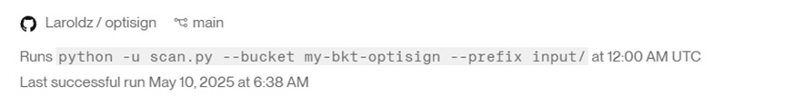
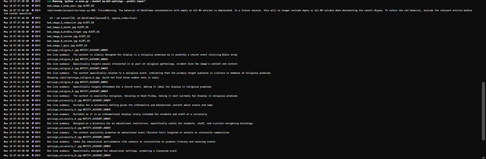
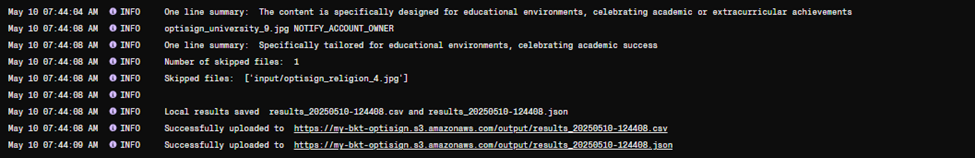

**SETUP**

Only requires python and a configured .env file, also Docker.

**RUN COMMANDS**

  DOCKERFILE

•	To run the dockerfile, do docker build -t s3-vision-scan:latest .

•	Then, run 
docker run -e OPENAI_API_KEY=<OPEN AI KEY> -e ASSISTANT_ID=<ASSISTANT ID> -e INPUT_BUCKET=<my-bkt-optisign> -e INPUT_PREFIX=input/ -e OUTPUT_PREFIX=output/ s3-vision-scan:latest

•	Change highlights as needed

  LOCALLY 

•	After inputting the env file, it can be run with python scan.py --bucket my-bkt-optisign --prefix input/

•	Or, debug mode to test different parsing inputs with python scan.py --debug=”string1|string2|string3|…”

**WHY I CHOSE THIS MODEL**

The assistant runs on GPT 4o-turbo-2024-04-09 because it performed the best across macro and microaverages, F1 score for classes, as well as getting all the safety booleans correct. 4o struggled with overthinking it (e.g the venue might have different rules for things like beer) and 4o-mini tended to have malformed inputs but classified all of them correctly, but had poor audience classification.

**OUTPUT (done on Render)**

